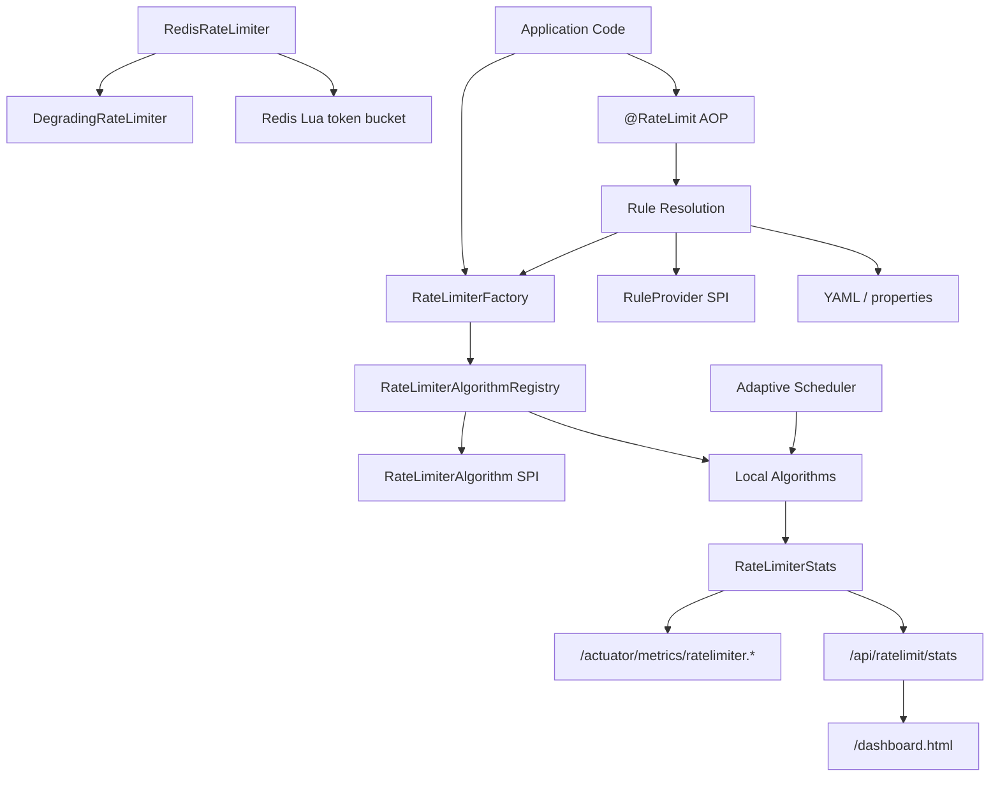

# Distributed RateLimiter

高性能分布式限流中间件项目，目标是系统性展示 Java 并发、经典限流算法、Redis Lua 原子限流、自适应限流、Spring Boot 接入、SPI 扩展、JMH 基准测试、Actuator/Micrometer 监控和本地 Dashboard。

当前阶段：**Phase 8 简历项目强化**。核心功能已经覆盖单机限流、分布式 Redis 限流、自适应限流、注解接入、SPI 扩展、监控 REST API、Actuator/Micrometer 指标、Dashboard 和 Guava/Sentinel benchmark 对比入口。

## Table of Contents

- [Feature Matrix](#feature-matrix)
- [Quick Start](#quick-start)
- [Architecture](#architecture)
- [Local Algorithms](#local-algorithms)
- [Spring Annotation Usage](#spring-annotation-usage)
- [Distributed Redis Limiting](#distributed-redis-limiting)
- [Adaptive Limiting](#adaptive-limiting)
- [Monitoring](#monitoring)
- [Benchmarking](#benchmarking)
- [SPI Extension Points](#spi-extension-points)
- [Development Notes](#development-notes)
- [Known Limitations](#known-limitations)
- [Roadmap](#roadmap)
- [Documentation](#documentation)

## Feature Matrix

| Area | Status | Notes |
|------|--------|-------|
| Token Bucket | Done | Supports burst traffic, bulk permits, stats, runtime config update |
| Leaky Bucket | Done | Smooth drain model, capacity rejection, stats |
| Fixed Window | Done | Atomic counter and window rollover |
| Sliding Window | Done | Exact timestamp-window implementation |
| Redis Lua limiter | Done | Atomic token bucket through Lua script |
| Redis fallback | Done | `DegradingRateLimiter` falls back to local limiter |
| Adaptive limiter | Done | System metrics model, PID controller, scheduler, configurable local limiter |
| Spring `@RateLimit` | Done | AOP fast-fail integration |
| YAML/properties rules | Done | Configuration wins over annotation attributes for matching keys |
| Java SPI | Done | `RejectHandler`, `RuleProvider`, `RateLimiterAlgorithm` |
| JMH benchmarks | Done | Local algorithm benchmarks plus Guava/Sentinel comparison entries |
| Metrics REST API | Done | `GET /api/ratelimit/stats` for current JVM factory-created limiters |
| Actuator/Micrometer | Done | Aggregate gauges under `/actuator/metrics/ratelimiter.*` |
| Dashboard | Done | Static HTML + ECharts page at `/dashboard.html` |

## Quick Start

Prerequisites:

- Java 17+
- Maven 3.9+
- Redis is only required when manually wiring `RedisRateLimiter`

Run all tests:

```powershell
mvn test
```

Start the Spring Boot app:

```powershell
mvn spring-boot:run
```

Open the local dashboard:

```text
http://localhost:8080/dashboard.html
```

Generate demo traffic so the dashboard has data:

```powershell
curl http://localhost:8080/demo/orders
curl http://localhost:8080/demo/orders
curl http://localhost:8080/demo/orders
```

Read raw metrics:

```powershell
curl http://localhost:8080/api/ratelimit/stats
```

Read Actuator/Micrometer metrics:

```powershell
curl http://localhost:8080/actuator/metrics/ratelimiter.limiters
curl http://localhost:8080/actuator/metrics/ratelimiter.requests.allowed
curl http://localhost:8080/actuator/metrics/ratelimiter.requests.rejected
curl http://localhost:8080/actuator/metrics/ratelimiter.permits.available
```

Build and run a quick JMH smoke benchmark:

```powershell
mvn -Pbenchmark -DskipTests package
java -jar target/benchmarks.jar LocalRateLimiterBenchmark.tokenBucketSingleThread -wi 1 -i 1 -f 1
```

More command-focused setup notes are in [docs/QUICK_START.md](docs/QUICK_START.md).

## Architecture



The core API stays small: callers use `RateLimiter` and `RateLimiterConfig`; factories and SPI loaders decide which implementation to create. Distributed Redis limiting, adaptive limiting, AOP, metrics, and dashboard are layered around that core instead of changing the algorithm interface.

Detailed design notes are in [docs/ARCHITECTURE.md](docs/ARCHITECTURE.md).

## Local Algorithms

```java
RateLimiterConfig config = RateLimiterConfig.builder(AlgorithmType.TOKEN_BUCKET)
        .capacity(100)
        .ratePerSecond(10.0)
        .window(Duration.ofSeconds(1))
        .build();

RateLimiter limiter = new TokenBucketRateLimiter(config);

if (limiter.tryAcquire()) {
    // handle request
}
```

| Algorithm | Strength | Tradeoff |
|----------|----------|----------|
| Token Bucket | Allows short bursts while enforcing average rate | Burst size depends on capacity |
| Leaky Bucket | Smooths traffic more strictly | Less tolerant of burst traffic |
| Fixed Window | Simple and fast | Boundary burst is possible |
| Sliding Window | More accurate over the recent time window | Stores timestamps and uses synchronization |

## Spring Annotation Usage

Business methods can be protected with `@RateLimit`:

```java
@RateLimit(
        key = "order:create",
        algorithm = AlgorithmType.TOKEN_BUCKET,
        capacity = 100,
        ratePerSecond = 10.0,
        windowMillis = 1000,
        permits = 1
)
public void createOrder() {
    // business logic
}
```

Rules can also be configured in `application.yml` or `application.properties`. If the same key exists in configuration, the configured rule overrides annotation attributes.

```yaml
ratelimiter:
  rules:
    order:create:
      algorithm: TOKEN_BUCKET
      capacity: 100
      rate-per-second: 10.0
      window-millis: 1000
      permits: 1
```

```java
@RateLimit(key = "order:create")
public void createOrder() {
    // business logic
}
```

Rule resolution priority:

1. SPI `RuleProvider`
2. YAML/properties `RateLimitRuleProvider`
3. `@RateLimit` annotation attributes

## Distributed Redis Limiting

Phase 3 introduced Redis Lua token bucket limiting:

- Lua guarantees atomic refill and acquire.
- `RedisRateLimiter` implements the same `RateLimiter` interface as local algorithms.
- `DegradingRateLimiter` falls back to a local limiter when Redis is unhealthy or command execution fails.
- `RedisHealthChecker` uses `PING` to track Redis availability.

```java
RedisCommandExecutor redis = new SpringDataRedisCommandExecutor(stringRedisTemplate);
RateLimiterConfig config = RateLimiterConfig.builder(AlgorithmType.DISTRIBUTED_TOKEN_BUCKET)
        .capacity(1000)
        .ratePerSecond(100.0)
        .window(Duration.ofSeconds(1))
        .build();

RateLimiter limiter = new RedisRateLimiter("api:create-order", config, redis);
```

Fallback example:

```java
RateLimiter localFallback = new TokenBucketRateLimiter(config.toBuilder()
        .capacity(100)
        .ratePerSecond(10.0)
        .build());
RateLimiter limiter = new DegradingRateLimiter(distributedLimiter, localFallback, redisHealthChecker);
```

## Adaptive Limiting

Adaptive limiting is built from focused components:

- `SystemMetricsCollector` captures CPU, heap memory, and current QPS snapshots.
- `PIDController` calculates an adjustment ratio from target CPU utilization.
- `AdaptiveRateLimiterScheduler` applies the ratio to adaptive limiters and clamps QPS between configured min/max values.
- `ConfigurableAdaptiveRateLimiter` wraps local limiting with adjustable QPS.

```java
AdaptiveRateLimiterConfig adaptiveConfig = new AdaptiveRateLimiterConfig(
        AlgorithmType.TOKEN_BUCKET,
        100,
        20.0,
        10.0,
        80.0,
        Duration.ofSeconds(1)
);

ConfigurableAdaptiveRateLimiter limiter = ConfigurableAdaptiveRateLimiter.create(adaptiveConfig);
AdaptiveRateLimiterScheduler scheduler = new AdaptiveRateLimiterScheduler(
        new SystemMetricsCollector(() -> (long) limiter.currentQps()),
        new PIDController(0.60, 1.0, 0.0, 0.0),
        List.of(limiter)
);

scheduler.adjust(1.0);
```

## Monitoring

Metrics endpoint:

```powershell
curl http://localhost:8080/api/ratelimit/stats
```

Response shape:

```json
[
  {
    "key": "order:create",
    "allowedRequests": 10,
    "rejectedRequests": 2,
    "availablePermits": 88
  }
]
```

Dashboard:

```text
http://localhost:8080/dashboard.html
```

Actuator aggregate metrics:

```powershell
curl http://localhost:8080/actuator/metrics/ratelimiter.limiters
curl http://localhost:8080/actuator/metrics/ratelimiter.requests.allowed
curl http://localhost:8080/actuator/metrics/ratelimiter.requests.rejected
curl http://localhost:8080/actuator/metrics/ratelimiter.permits.available
```

The REST endpoint and Actuator gauges report limiters created through the current JVM `RateLimiterFactory`. They do not aggregate multiple application instances and do not query Redis global counters.

To create visible demo data, call:

```powershell
curl http://localhost:8080/demo/orders
```

This endpoint uses a local token bucket with key `demo:orders`. After a few calls, refresh `/dashboard.html` or read `/api/ratelimit/stats`.

## Benchmarking

Build benchmark jar:

```powershell
mvn -Pbenchmark -DskipTests package
```

Run all local limiter benchmarks:

```powershell
java -jar target/benchmarks.jar LocalRateLimiterBenchmark
```

Run Guava and Sentinel comparison benchmarks:

```powershell
java -jar target/benchmarks.jar ComparisonRateLimiterBenchmark
```

Smoke commands:

```powershell
java -jar target/benchmarks.jar LocalRateLimiterBenchmark.tokenBucketSingleThread -wi 1 -i 1 -f 1
java -jar target/benchmarks.jar ComparisonRateLimiterBenchmark.sentinel -wi 1 -i 1 -f 1
```

README does not publish invented benchmark numbers. Any future performance table should include the local machine, JDK version, command, benchmark settings, and raw output source.

## SPI Extension Points

### RejectHandler

```java
public class LoggingRejectHandler implements RejectHandler {

    @Override
    public void handle(String key, RateLimit rateLimit) {
        throw new RateLimitException("custom rejected: " + key);
    }

    @Override
    public int priority() {
        return 100;
    }
}
```

Register with:

```text
META-INF/services/com.example.ratelimiter.spi.RejectHandler
```

### RuleProvider

```java
public class CustomRuleProvider implements RuleProvider {

    @Override
    public Optional<RateLimitRule> findRule(String key) {
        if (!"order:create".equals(key)) {
            return Optional.empty();
        }
        RateLimitRule rule = new RateLimitRule();
        rule.setAlgorithm(AlgorithmType.TOKEN_BUCKET);
        rule.setCapacity(100);
        rule.setRatePerSecond(10.0);
        rule.setWindowMillis(1000);
        rule.setPermits(1);
        return Optional.of(rule);
    }

    @Override
    public int priority() {
        return 100;
    }
}
```

Register with:

```text
META-INF/services/com.example.ratelimiter.spi.RuleProvider
```

### RateLimiterAlgorithm

```java
public class WarmupRateLimiterAlgorithm implements RateLimiterAlgorithm {

    @Override
    public String name() {
        return "warmup";
    }

    @Override
    public RateLimiter create(RateLimiterConfig config) {
        return new WarmupRateLimiter(config);
    }

    @Override
    public int priority() {
        return 100;
    }
}
```

Register with:

```text
META-INF/services/com.example.ratelimiter.spi.RateLimiterAlgorithm
```

Custom algorithms use string names through `RateLimiterConfig.customAlgorithm("warmup")`; they do not override built-in `AlgorithmType` enum values.

## Development Notes

- Correctness comes before performance.
- Every algorithm has unit and concurrency-oriented tests.
- Performance claims must come from reproducible JMH runs.
- README and tests are treated as deliverables.
- Feature work is implemented in small branches/worktrees and merged after verification.

## Known Limitations

- `@RateLimit` currently supports local limiter creation; Redis and adaptive modes require explicit wiring.
- Rule providers are loaded through Java SPI and are not dynamically refreshed at runtime.
- `RuleProvider`, `RejectHandler`, and `RateLimiterAlgorithm` choose the highest `priority()` implementation for conflicts; they do not merge same-type providers.
- The dashboard is a local static page backed by one JVM's `/api/ratelimit/stats`.
- REST metrics and Actuator gauges are not cluster-aggregated and do not include Redis global counters.
- Actuator metrics are aggregate gauges; per-key metric tags are intentionally avoided to prevent unbounded meter cardinality.
- Benchmark comparison semantics are not identical across Token Bucket, Guava `RateLimiter`, and Sentinel; results are reference data, not a universal ranking.

## Roadmap

- Add README screenshots or GIF for the dashboard.
- Add optional SSE metrics stream if live browser updates are needed.
- Add Testcontainers-based Redis integration tests if Docker is available.
- Add runnable examples under an `examples/` directory.
- Package as a reusable starter module if this moves beyond demo/middleware study scope.

## Documentation

- [Quick Start](docs/QUICK_START.md)
- [Architecture Notes](docs/ARCHITECTURE.md)
- [Interview Notes](docs/INTERVIEW_NOTES.md)
- [Benchmark Report](docs/BENCHMARK_REPORT.md)
- [Project Outline](PROJECT_OUTLINE.md)
- [Full Specification](Distributed-RateLimiter-Spec.md)
