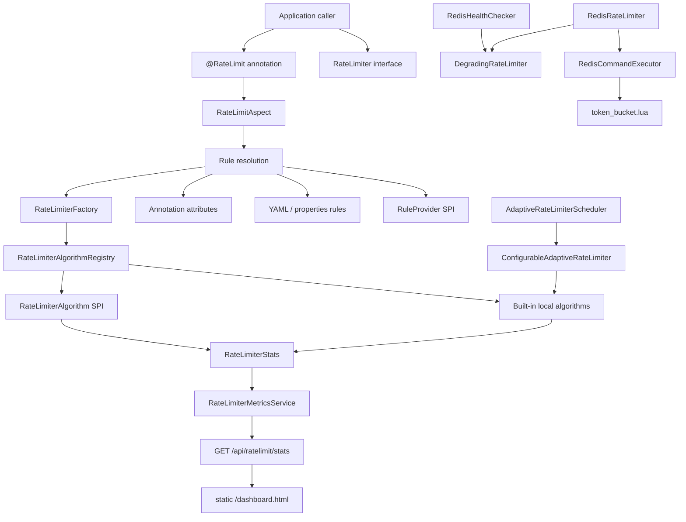

# Architecture Notes

This project is organized around a small rate limiter core and optional integration layers around it. The intent is to keep algorithm behavior testable without requiring Spring, Redis, or a dashboard runtime.

## System View



## Core API

The core API is intentionally narrow:

- `RateLimiter` exposes acquire operations, configuration updates, and statistics.
- `RateLimiterConfig` carries algorithm, capacity, rate, window, and custom algorithm name settings.
- `RateLimiterStats` records allowed requests, rejected requests, and available permits.
- `RateLimiterFactory` owns key-based reuse and metrics snapshot visibility for factory-created limiters.

This lets the same interface back local algorithms, Redis wrappers, adaptive wrappers, and AOP usage.

## Local Algorithms

The local algorithms live under `com.example.ratelimiter.algorithm`:

- `TokenBucketRateLimiter`
- `LeakyBucketRateLimiter`
- `FixedWindowRateLimiter`
- `SlidingWindowRateLimiter`

Each algorithm owns its own synchronization strategy. The project currently favors understandable correctness over lock-free complexity. Algorithm tests cover capacity boundaries, timing behavior, bulk permits, config updates, and concurrent access.

## Distributed Redis Layer

The Redis layer is explicit rather than automatically created by the factory:

- `RedisRateLimiter` implements `RateLimiter`.
- `RedisCommandExecutor` abstracts Redis execution.
- `SpringDataRedisCommandExecutor` adapts Spring Data Redis.
- `token_bucket.lua` performs atomic refill and acquire.
- `RedisHealthChecker` maintains Redis health state.
- `DegradingRateLimiter` composes a distributed limiter with a local fallback.

This keeps Redis dependencies out of local algorithm tests and makes failure behavior visible to callers.

## Adaptive Layer

The adaptive layer is split into small components:

- `SystemMetrics` is a snapshot model.
- `SystemMetricsCollector` reads CPU, heap memory, and caller-provided current QPS.
- `PIDController` turns target CPU utilization into an adjustment ratio.
- `AdaptiveRateLimiterScheduler` applies the adjustment and clamps QPS to configured bounds.
- `ConfigurableAdaptiveRateLimiter` adapts a local limiter to a mutable QPS target.

The scheduler is not bound to Spring `@Scheduled`; the caller decides when to run adjustment.

## Spring Integration

`@RateLimit` and `RateLimitAspect` provide fast-fail method protection. Rule resolution order is:

1. Java SPI `RuleProvider`
2. YAML/properties `RateLimitRuleProvider`
3. `@RateLimit` annotation attributes

When a request is rejected, the selected `RejectHandler` handles the rejection. The default behavior throws `RateLimitException`.

## SPI Layer

The SPI package exposes three extension points:

- `RejectHandler`
- `RuleProvider`
- `RateLimiterAlgorithm`

Loaders choose the highest priority implementation for conflicts. Custom rate limiter algorithms use string names through `RateLimiterConfig.customAlgorithm(...)`; they do not replace built-in enum values.

## Monitoring Layer

The monitoring layer currently reports local JVM snapshots:

- `RateLimiterMetricsService` reads snapshots from `RateLimiterFactory`.
- `RateLimiterMetricsController` exposes `GET /api/ratelimit/stats`.
- `dashboard.html` fetches that endpoint and renders summary metrics, ECharts charts, and a limiter table.

The endpoint does not aggregate cluster state and does not query Redis counters.

## Package Map

```text
com.example.ratelimiter
├── adaptive      Adaptive metrics, PID, scheduler, configurable limiter
├── algorithm     Local limiter implementations
├── annotation    @RateLimit
├── aop           Spring AOP integration
├── config        AlgorithmType and RateLimiterConfig
├── core          RateLimiter interface and RateLimiterFactory
├── distributed   Redis limiter, Redis command abstraction, fallback
├── exception     Project exceptions
├── metrics       REST metrics snapshot API
├── rule          Config-driven rate limit rules
├── spi           Java SPI extension interfaces and loaders
└── stats         Runtime statistics model
```
